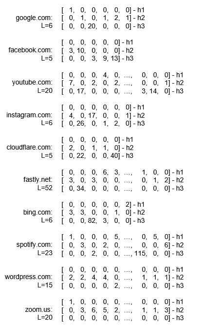

# H123-Website-Fingerprinting
<p align="center">
  
</p>

The code and dataset for the paper ***HOLMES & WATSON: A Robust and Lightweight HTTPS Website Fingerprinting through HTTP Version Parallelism*** accepted in **The ACM Web Conference (WWW) 2025**. [Read the Paper](./images/WWW25_1202_rfp.pdf).

⚠️ The code is intended for **RESEARCH PURPOSES ONLY**! ⚠️ 

If you find this repo useful, please cite our paper.

```bibtex
TBD
```


The figure below shows the specific manifestations of the proposed H123 fingerprint on the most popular websites, indicating that compared to traditional website fingerprints (such as using hundreds of statistical features or packet length sequences), the H123 fingerprint is visually concise, information-rich, more powerful, and exhibits clear distinguishability.
<p align="center">
  
</p>


## Repositories Organization
#### [*/DATA_COLLECTION*](/DATA_COLLECTION)
This tool provides a high-availability solution for collecting website fingerprint data, allowing you to specify parameters such as the domain list, collection frequency, browser type, and network environment.
#### [*/DATASET*](/DATASET)
This path contains the **H123 dataset** used in the paper, covering various scenarios like *popular*, *censorship*, *bandwidth*, *browser*, and *open-world*. We also provide the complete dataset (**approx. 2TB**), including pcap files and data samples in formats like [*DF*](https://github.com/deep-fingerprinting/df) and [*TAM*](https://github.com/robust-fingerprinting/RF). Some datasets are available on the [*Zenodo platform*](https://zenodo.org/records/14727250), and for full access, please contact us at [*chengyifei@iie.ac.cn*](chengyifei@iie.ac.cn).
#### [*/HOLMES*](/HOLMES)
This path contains the code implementation of the **HOLMES** module from the paper. You can easily extract H123 fingerprints from raw pcap files using the [pcap_to_H123.py](/HOLMES/pcap_to_H123.py) script.
#### [*/WATSON*](/WATSON)
This path contains the code implementation of the **WATSON** module from the paper.


## Setup

#### Requirements
- Python 3.6+ & requirements.txt modules


## Usage Examples
#### Data Collecting
```bash
python3 ./DATA_COLLECTION/collect_main.py \
    --domain ./top_1600_domains.csv \
    --times 10 \
    --browser chrome \
    --network starlink-like
```

#### H123 Fingerprint Generation
```bash
python3 ./HOLMES/pcap_to_H123.py --F ./HOLMES/HOLMES_unit_test/test4_doi_org.pcap
```

#### WATSON Attacking
```bash
python3 ./WATSON/watson_attack.py --N 10 --distance watson
```